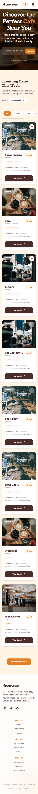
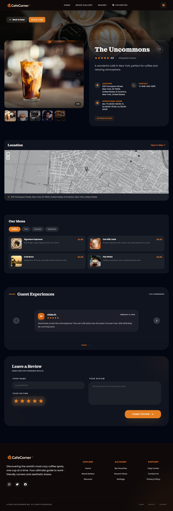
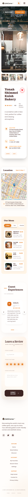
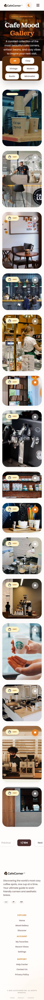
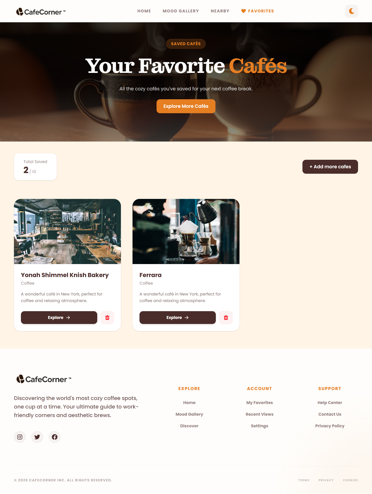
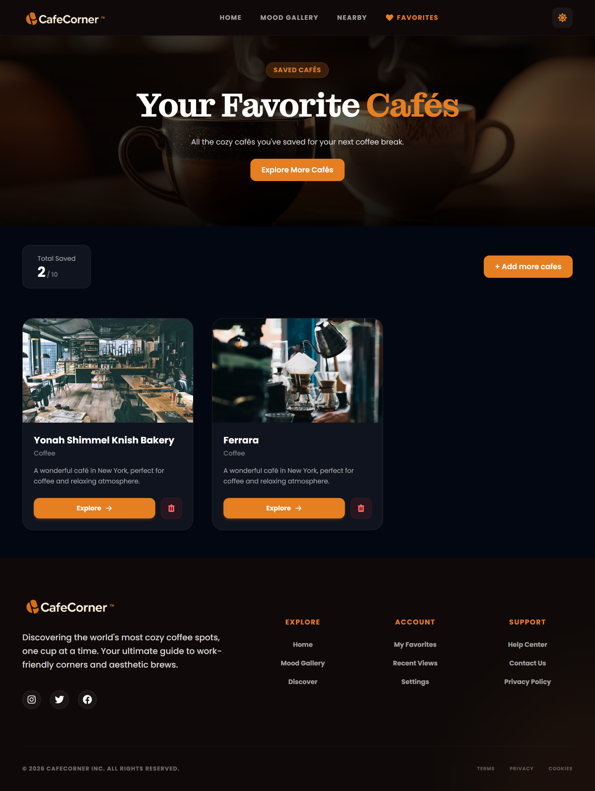
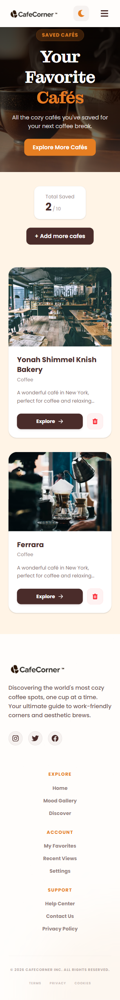
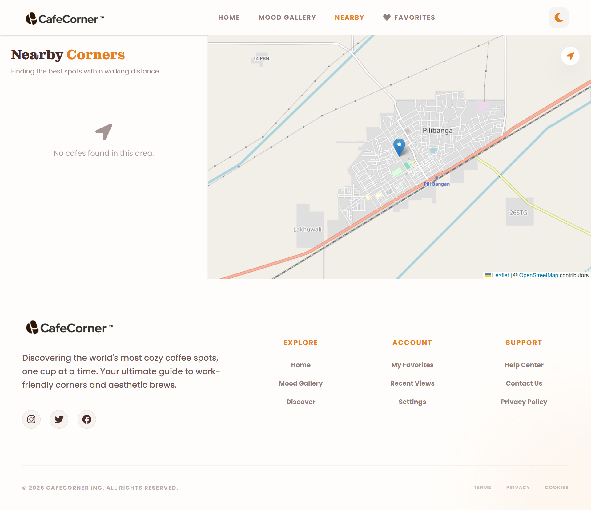
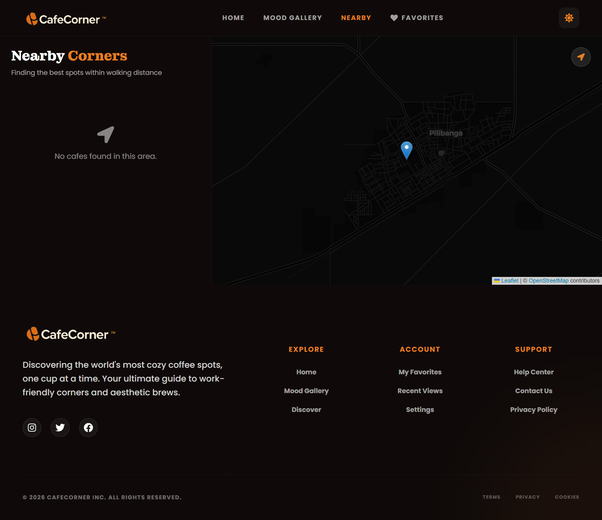
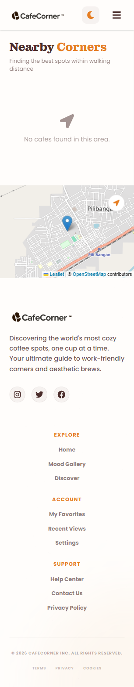

# ☕ CafeCorner (Cafe Finder App)

**CafeCorner** is a premium, responsive web application designed for coffee enthusiasts to discover the best cafes nearby. It offers a seamless experience with an interactive map, detailed cafe insights, high-quality image galleries, and a personalized favorites system.

[🚀 Explore the Live Demo](https://cafe-corner-ten.vercel.app/)

---

## 🖼️ Screenshots

### 🏠 Home Page
Explore a curated list of cafes with smart search and discovery tools.

| Light Mode | Dark Mode | Mobile View |
|:---:|:---:|:---:|
|  |  |  |

---

### ☕ Cafe Detail Page
Immerse yourself in cafe details, ratings, and atmospheric galleries.

| Light Mode | Dark Mode | Mobile View |
|:---:|:---:|:---:|
|  |  |  |

---

### 🖼️ Mood Gallery
Visualize the vibe with high-resolution photography.

| Light Mode | Dark Mode | Mobile View |
|:---:|:---:|:---:|
|  |  |  |

---

### ❤️ Favorites Page
Your personal collection of must-visit coffee spots.

| Light Mode | Dark Mode | Mobile View |
|:---:|:---:|:---:|
|  |  |  |

---

### 📍 Map & Discover
Interactive location-based discovery powered by advanced mapping.

| Light Mode | Dark Mode | Mobile View |
|:---:|:---:|:---:|
|  |  |  |

---

## 🛠️ Tech Stack & Architecture

### Core Technologies
- **Framework:** React 18 with TypeScript
- **Build Tool:** Vite (for lightning-fast development)
- **Styling:** Vanilla CSS & Tailwind CSS (for premium UI/UX)
- **State Management:** React Context API
- **Routing:** React Router DOM v6
- **Animations:** Framer Motion (smooth transitions & micro-interactions)

### Key Libraries
- **Maps:** Leaflet & React Leaflet
- **Icons:** React Icons (Font Awesome, Lucide)
- **Testing:** Vitest & React Testing Library

---

## 🔌 API Choices & Justification

1.  **Geoapify Places API**: Chosen for its robust geolocation data and comprehensive database of points of interest (POIs). It provides accurate cafe suggestions, ratings, and contact info.
2.  **Pexels/Unsplash API**: Used to fetch stunning, high-definition images that match the "mood" of each cafe, ensuring a visually premium experience.
3.  **Leaflet (OpenStreetMap)**: Selected as a lightweight, open-source alternative to Google Maps, offering excellent performance and flexibility for custom styling.

---

## ⚙️ Setup & Installation

### Prerequisites
- Node.js (v18 or higher)
- npm or yarn

### Local Setup

1. **Clone the repository**
   ```bash
   git clone https://github.com/poojayadavcoder/cafe_corner
   cd cafe_corner
   ```

2. **Install dependencies**
   ```bash
   npm install
   ```

3. **Configure Environment Variables**
   - Copy the `.env.example` file to a new file named `.env`:
     ```bash
     cp .env.example .env
     ```
   - Open `.env` and add your API keys:
     ```env
     VITE_GEOAPIFY_API_KEY=your_actual_key_here
     VITE_IMAGE_API_KEY=your_actual_key_here
     ```

4. **Run the development server**
   ```bash
   npm run dev
   ```

5. **Access the app**
   Navigate to `http://localhost:5173`.

---

## ⚠️ Known Issues & Limitations
- **API Rate Limits**: The free tier of Geoapify may limit the number of searches per day.
- **Image Variety**: Occasional generic images if specific cafe photos aren't available through the image API.
- **Offline Map**: Map tiles require an active internet connection to load.

---

## 🗺️ Roadmap & Future Improvements
- [ ] **User Authentication**: Allow users to sync favorites across devices.
- [ ] **Reviews & Ratings**: Implement a custom rating system for users to leave feedback.
- [ ] **Booking Integration**: Add the ability to reserve tables directly from the app.
- [ ] **PWA Support**: Make the app installable for a better mobile experience.
- [ ] **Advanced Filtering**: Filter by "Quiet Level", "WiFi Speed", and "Vegan Options".

---

## 🚀 Live Demo
Check out the live version here: [https://cafe-corner-ten.vercel.app/](https://cafe-corner-ten.vercel.app/)

---

Developed with ❤️ by [Pooja Yadav](https://github.com/poojayadavcoder)


